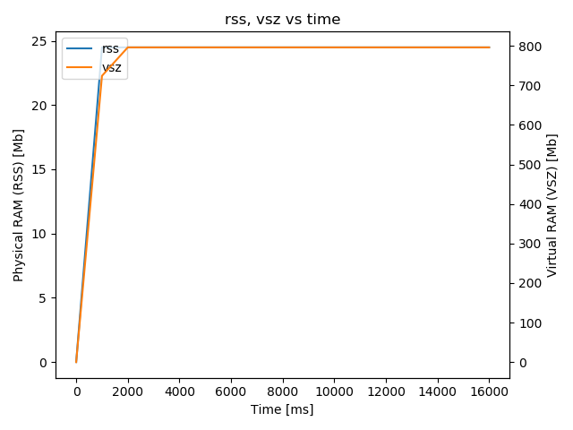

## Overview

In order to evaluate the improvements proposed in [this pull request](https://github.com/ros2/rclcpp/pull/690), two sets of tests were run, one using `rclcpp` of the PR the other without it.

## Summary

No obvious improvements in terms of cpu and mem were observed.

## vcs

### ROS2 with no rclcpp#690 patch

See [ros2.no-rclcpp690.repos](ros2-no-rclcpp690.repos) for package versions used to build ROS2 for the tests.

### ROS2 with rclcpp#690 patch

See [ros2.with-rclcpp690.repos](ros2-with-rclcpp690.repos) for package versions used to build ROS2 for the tests, in which [this line](https://github.com/yyu/ros2-performance/blob/rclcpp690/performances/performance_test/ros2.with-rclcpp690.repos#L189) shows the patch is being used.

## Commands

### CPU Experiment

```
. $ROS2_SDK_INSTALL_PATH/local_setup.bash
. $ROS2_PERFORMANCE_TEST_INSTALL_PATH/local_setup.bash
. env.sh

export MAX_PUBLISHERS=1
export MAX_SUBSCRIBERS=5
export MSG_TYPES=10b
export PUBLISH_FREQUENCY=100
export DURATION=30
export NUM_EXPERIMENTS=3
export MON_CPU_RAM=1

bash scripts/pub_sub_ros2.sh
```

### Memory Experiment

```
. $ROS2_SDK_INSTALL_PATH/local_setup.bash
. $ROS2_PERFORMANCE_TEST_INSTALL_PATH/local_setup.bash
. env.sh

export MAX_PUBLISHERS=1
export MAX_SUBSCRIBERS=1
export MSG_TYPES="10b 100b 250b 1kb 10kb 250kb 1mb 4mb 8mb"
export DURATION=10
export NUM_EXPERIMENTS=3

bash scripts/only_subs.sh
```

## Results

|Result Type| Modified | Original |
|-----------|-----------|-----------|
| CPU |  |  |
| rss+vsz |  |  |
