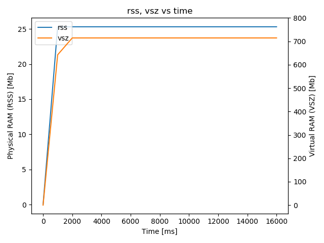

## Overview

In order to evaluate the improvements proposed in [this pull request](https://github.com/ros2/rclcpp/pull/690), two sets of tests were run, one using `rclcpp` of the PR the other without it.

## Summary

No obvious improvements in terms of cpu and mem were observed.

## vcs

### ROS2 with no rclcpp#690 patch

| package | version |
|------|---------|
|  src/ament/ament_cmake                      |  0.6.1   |
|  src/ament/ament_index                      |  0.5.1   |
|  src/ament/ament_lint                       |  0.6.4   |
|  src/ament/ament_package                    |  0.6.0   |
|  src/ament/googletest                       |  c8b6f2b |
|  src/ament/osrf_pycommon                    |  0.1.6   |
|  src/ament/uncrustify_vendor                |  1.1.0   |
|  src/eProsima/Fast-CDR                      |  v1.0.8  |
|  src/eProsima/Fast-RTPS                     |  v1.7.2  |
|  src/osrf/osrf_testing_tools_cpp            |  1.1.0   |
|  src/ros-perception/laser_geometry          |  2.0.0   |
|  src/ros-planning/navigation_msgs           |  2.0.0   |
|  src/ros-visualization/python_qt_binding    |  1.0.1   |
|  src/ros-visualization/qt_gui_core          |  1.0.4   |
|  src/ros-visualization/rqt                  |  1.0.2   |
|  src/ros-visualization/rqt_console          |  1.0.1   |
|  src/ros-visualization/rqt_msg              |  1.0.1   |
|  src/ros-visualization/rqt_plot             |  1.0.2   |
|  src/ros-visualization/rqt_publisher        |  1.0.3   |
|  src/ros-visualization/rqt_py_console       |  1.0.0   |
|  src/ros-visualization/rqt_service_caller   |  1.0.1   |
|  src/ros-visualization/rqt_shell            |  1.0.0   |
|  src/ros-visualization/rqt_srv              |  1.0.1   |
|  src/ros-visualization/rqt_top              |  1.0.0   |
|  src/ros/class_loader                       |  1.2.0   |
|  src/ros/pluginlib                          |  2.2.1   |
|  src/ros/resource_retriever                 |  2.1.0   |
|  src/ros/ros_environment                    |  2.2.0   |
|  src/ros/urdfdom_headers                    |  1.0.2   |
|  src/ros2/ament_cmake_ros                   |  0.5.0   |
|  src/ros2/common_interfaces                 |  0.6.1   |
|  src/ros2/console_bridge_vendor             |  1.1.0   |
|  src/ros2/demos                             |  0.6.2   |
|  src/ros2/example_interfaces                |  0.6.2   |
|  src/ros2/examples                          |  0.6.3   |
|  src/ros2/geometry2                         |  0.10.1  |
|  src/ros2/kdl_parser                        |  2.2.0   |
|  src/ros2/launch                            |  0.7.4   |
|  src/ros2/libyaml_vendor                    |  1.0.0   |
|  src/ros2/message_filters                   |  3.0.0   |
|  src/ros2/orocos_kinematics_dynamics        |  3.1.0   |
|  src/ros2/poco_vendor                       |  1.1.1   |
|  src/ros2/rcl                               |  0.6.5   |
|  src/ros2/rcl_interfaces                    |  0.6.3   |
|  src/ros2/rcl_logging                       |  0.2.0   |
|  src/ros2/rclcpp                            |  0.6.4   |
|  src/ros2/rclpy                             |  0.6.4   |
|  src/ros2/rcutils                           |  0.6.2   |
|  src/ros2/realtime_support                  |  0.6.0   |
|  src/ros2/rmw                               |  0.6.1   |
|  src/ros2/rmw_connext                       |  0.6.1   |
|  src/ros2/rmw_fastrtps                      |  0.6.2   |
|  src/ros2/rmw_implementation                |  0.6.1   |
|  src/ros2/rmw_opensplice                    |  0.6.3   |
|  src/ros2/robot_state_publisher             |  2.1.0   |
|  src/ros2/ros1_bridge                       |  0.6.2   |
|  src/ros2/ros2cli                           |  0.6.3   |
|  src/ros2/rosidl                            |  0.6.3   |
|  src/ros2/rosidl_dds                        |  0.6.0   |
|  src/ros2/rosidl_defaults                   |  0.6.0   |
|  src/ros2/rosidl_python                     |  0.6.3   |
|  src/ros2/rosidl_typesupport                |  0.6.3   |
|  src/ros2/rosidl_typesupport_connext        |  0.6.4   |
|  src/ros2/rosidl_typesupport_fastrtps       |  0.6.1   |
|  src/ros2/rosidl_typesupport_opensplice     |  0.6.2   |
|  src/ros2/rviz                              |  5.1.0   |
|  src/ros2/sros2                             |  0.6.3   |
|  src/ros2/system_tests                      |  0.6.1   |
|  src/ros2/tinyxml2_vendor                   |  0.6.1   |
|  src/ros2/tinyxml_vendor                    |  0.5.0   |
|  src/ros2/tlsf                              |  0.5.0   |
|  src/ros2/unique_identifier_msgs            |  2.0.0   |
|  src/ros2/urdf                              |  2.2.0   |
|  src/ros2/urdfdom                           |  2.1.0   |
|  src/ros2/yaml_cpp_vendor                   |  5.0.0   |

See [ros2.no-rclcpp690.repos](ros2.no-rclcpp690.repos) for details

### ROS2 with rclcpp#690 patch

| package | version |
|------|---------|
|  src/ament/ament_cmake                      |  master                                    |
|  src/ament/ament_index                      |  master                                    |
|  src/ament/ament_lint                       |  master                                    |
|  src/ament/ament_package                    |  master                                    |
|  src/ament/googletest                       |  ros2                                      |
|  src/ament/uncrustify_vendor                |  master                                    |
|  src/eProsima/Fast-CDR                      |  master                                    |
|  src/eProsima/Fast-RTPS                     |  master                                    |
|  src/osrf/osrf_pycommon                     |  master                                    |
|  src/osrf/osrf_testing_tools_cpp            |  master                                    |
|  src/ros-perception/laser_geometry          |  ros2                                      |
|  src/ros-planning/navigation_msgs           |  ros2                                      |
|  src/ros-visualization/python_qt_binding    |  crystal-devel                             |
|  src/ros-visualization/qt_gui_core          |  crystal-devel                             |
|  src/ros-visualization/rqt                  |  crystal-devel                             |
|  src/ros-visualization/rqt_console          |  crystal-devel                             |
|  src/ros-visualization/rqt_msg              |  crystal-devel                             |
|  src/ros-visualization/rqt_plot             |  crystal-devel                             |
|  src/ros-visualization/rqt_publisher        |  crystal-devel                             |
|  src/ros-visualization/rqt_py_console       |  crystal-devel                             |
|  src/ros-visualization/rqt_service_caller   |  crystal-devel                             |
|  src/ros-visualization/rqt_shell            |  crystal-devel                             |
|  src/ros-visualization/rqt_srv              |  crystal-devel                             |
|  src/ros-visualization/rqt_top              |  crystal-devel                             |
|  src/ros/class_loader                       |  ros2                                      |
|  src/ros/pluginlib                          |  ros2                                      |
|  src/ros/resource_retriever                 |  ros2                                      |
|  src/ros/ros_environment                    |  crystal                                   |
|  src/ros/urdfdom_headers                    |  master                                    |
|  src/ros2/ament_cmake_ros                   |  0.7.0                                     |
|  src/ros2/common_interfaces                 |  0.7.0                                     |
|  src/ros2/console_bridge_vendor             |  master                                    |
|  src/ros2/demos                             |  0.7.0                                     |
|  src/ros2/example_interfaces                |  0.7.0                                     |
|  src/ros2/examples                          |  master                                    |
|  src/ros2/geometry2                         |  ros2                                      |
|  src/ros2/kdl_parser                        |  ros2                                      |
|  src/ros2/launch                            |  master                                    |
|  src/ros2/launch_ros                        |  master                                    |
|  src/ros2/libyaml_vendor                    |  master                                    |
|  src/ros2/message_filters                   |  master                                    |
|  src/ros2/orocos_kinematics_dynamics        |  ros2                                      |
|  src/ros2/poco_vendor                       |  master                                    |
|  src/ros2/rcl                               |  master                                    |
|  src/ros2/rcl_interfaces                    |  0.7.0                                     |
|  src/ros2/rcl_logging                       |  master                                    |
|  src/ros2/rclcpp                            |  ivanpauno/new_intra_process_manager       |
|  src/ros2/rclpy                             |  master                                    |
|  src/ros2/rcpputils                         |  master                                    |
|  src/ros2/rcutils                           |  0.7.0                                     |
|  src/ros2/realtime_support                  |  0.7.0                                     |
|  src/ros2/rmw                               |  master                                    |
|  src/ros2/rmw_connext                       |  0.7.0                                     |
|  src/ros2/rmw_fastrtps                      |  0.7.0                                     |
|  src/ros2/rmw_implementation                |  0.7.0                                     |
|  src/ros2/rmw_opensplice                    |  0.7.0                                     |
|  src/ros2/robot_state_publisher             |  ros2                                      |
|  src/ros2/ros1_bridge                       |  master                                    |
|  src/ros2/ros2cli                           |  0.7.1                                     |
|  src/ros2/rosidl                            |  0.7.0                                     |
|  src/ros2/rosidl_dds                        |  0.7.0                                     |
|  src/ros2/rosidl_defaults                   |  0.7.0                                     |
|  src/ros2/rosidl_python                     |  0.7.1                                     |
|  src/ros2/rosidl_typesupport                |  0.7.0                                     |
|  src/ros2/rosidl_typesupport_connext        |  0.7.0                                     |
|  src/ros2/rosidl_typesupport_fastrtps       |  0.7.0                                     |
|  src/ros2/rosidl_typesupport_opensplice     |  0.7.0                                     |
|  src/ros2/rviz                              |  ros2                                      |
|  src/ros2/sros2                             |  master                                    |
|  src/ros2/system_tests                      |  master                                    |
|  src/ros2/test_interface_files              |  master                                    |
|  src/ros2/tinydir_vendor                    |  master                                    |
|  src/ros2/tinyxml2_vendor                   |  master                                    |
|  src/ros2/tinyxml_vendor                    |  0.7.0                                     |
|  src/ros2/tlsf                              |  master                                    |
|  src/ros2/unique_identifier_msgs            |  master                                    |
|  src/ros2/urdf                              |  ros2                                      |
|  src/ros2/urdfdom                           |  ros2                                      |
|  src/ros2/yaml_cpp_vendor                   |  master                                    |

See [ros2.with-rclcpp690.repos](ros2.with-rclcpp690.repos) for details, in which [this line](https://github.com/yyu/ros2-performance/blob/rclcpp690/performances/performance_test/ros2.with-rclcpp690.repos#L189) shows the patch is being used.

## Commands

### CPU Experiment

```
. $ROS2_SDK_INSTALL_PATH/local_setup.bash
. $ROS2_PERFORMANCE_TEST_INSTALL_PATH/local_setup.bash
. env.sh

export MAX_PUBLISHERS=1
export MAX_SUBSCRIBERS=5
export MSG_TYPES=10b
export PUBLISH_FREQUENCY=100
export DURATION=30
export NUM_EXPERIMENTS=3
export MON_CPU_RAM=1

bash scripts/pub_sub_ros2.sh
```

### Memory Experiment

```
. $ROS2_SDK_INSTALL_PATH/local_setup.bash
. $ROS2_PERFORMANCE_TEST_INSTALL_PATH/local_setup.bash
. env.sh

export MAX_PUBLISHERS=1
export MAX_SUBSCRIBERS=1
export MSG_TYPES="10b 100b 250b 1kb 10kb 250kb 1mb 4mb 8mb"
export DURATION=10
export NUM_EXPERIMENTS=3

bash scripts/only_subs.sh
```

## Results

|Result Type| Modified | Original |
|-----------|-----------|-----------|
| CPU |  |  |
| rss,vsz |  |  |

